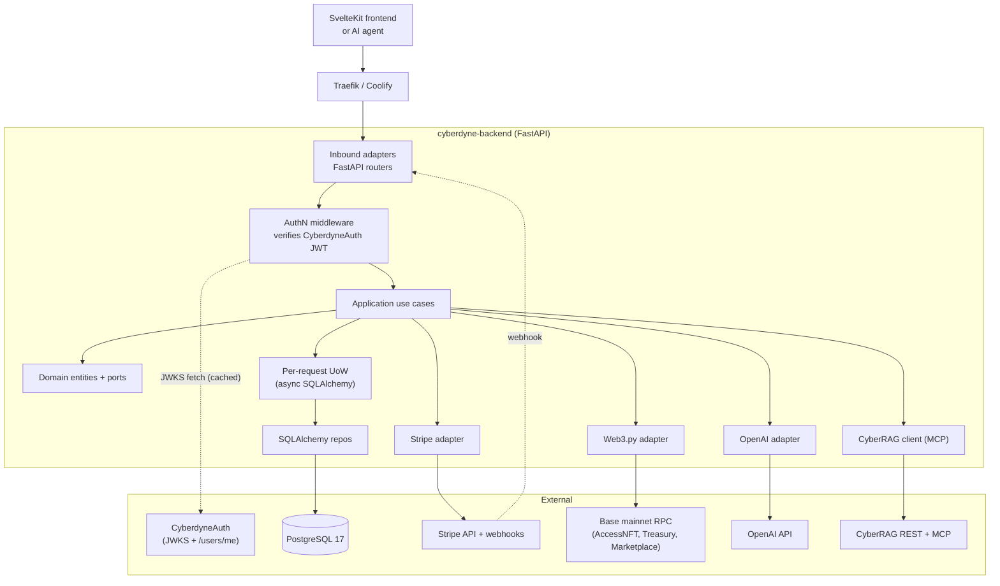

# Backend Roadmap

> **Status:** Draft v1 · 2026-05-25
> **Owner:** Leo
> **Repo:** new `cyberdynedao/backend/` sibling to `frontend/`
> **Audience:** Leo coming back cold in 3 weeks, plus contributors who already know the Cyberdyne stack (CyberdyneAuth, CyberRAG, OrgPilot)

This doc is the plan, not a spec. Anything declared here is the default; anything in **Open Questions** is unblocked work that needs a decision before Phase 2 starts.

---

## 1. Goals & Non-Goals

### Goals

1. Replace every static `src/lib/data/*.ts` file with a versioned, cache-friendly REST endpoint on a Python FastAPI service, hexagonal at its core, behind CyberdyneAuth.
2. Ship a learning platform (modules, paths, enrollment, progress, certificates) and a marketplace (Stripe-powered training + license keys + service inquiries) wired into the existing frontend views.
3. Stand up a single OpenAI-backed chat agent (tool calls + retrieval) grounded in Cyberdyne content (projects, blog, learning modules, services) so the terminal UI can answer "what does CyberSTAC do?" without hitting the static file.
4. Expose on-chain reality (NFT-tier access, treasury balances, proposal results, dividend windows) as cached read-models — not "another wallet flow". The wallet flow lives in CyberdyneAuth.
5. Hit **≥90% line coverage** on `domain/` and `application/` layers as a hard CI gate from day one (excluding integration-only adapters — same calibration the rest of the Cyberdyne stack uses).
6. Be Coolify-deployable on first push using the same recipe as CyberdyneAuth/OrgPilot (multi-stage `uv` Dockerfile, `alembic upgrade head` on entrypoint, Traefik via `expose:`).

### Non-Goals

- **We are not re-implementing CyberdyneAuth.** Login, sessions, CSRF, wallet sign-in, OAuth — all of that is consumed from `auth.backend.coolify.cyberdynecorp.ai`. We verify its JWTs and read claims; we never mint them.
- **We are not building a CMS.** Blog content is authored in Markdown in this repo (or pushed via an admin endpoint), not in a WYSIWYG editor. No drafts UI in v1.
- **We are not re-implementing CyberRAG.** The chat agent's knowledge backend is CyberRAG via MCP (or HTTP fallback) — see §5.6 for why we are not rolling pgvector inline.
- **We are not running a smart-contract indexer.** Web3 reads are on-demand + short-TTL cached, not a Subgraph clone. If we ever need historical indexing, that's a separate service.
- **No write-side Web3 in v1.** Dividend distribution oracles, treasury rebalance triggers — design the seam, but don't ship the keystore yet.
- **No Stripe Connect / multi-tenant payouts.** Single-tenant Stripe account, single payout destination. Marketplace sellers other than Cyberdyne itself is a v2 problem.

---

## 2. Stack Decision Table

| Concern | Choice | One-line rationale |
|---|---|---|
| Language | Python 3.12 | Matches CyberdyneAuth, CyberRAG, CyberDocExtractor — same toolchain, same lessons |
| Web framework | FastAPI 0.115+ | Same as every other Cyberdyne service; first-class async, OpenAPI, pydantic v2 |
| Package manager | `uv` | Proven Coolify recipe; `uv.lock` + `--frozen` build is reproducible |
| Task runner | `just` | Already conventional across the stack |
| ORM | SQLAlchemy 2.0 async + asyncpg | Same as CyberdyneAuth/OrgPilot; per-request Unit of Work |
| Migrations | Alembic | Run on container entrypoint; `alembic upgrade head && uvicorn …` |
| Primary store | PostgreSQL 17 | Single backup, single connection pool — Cyberdyne house rule |
| Vector / KG store | **None inline — delegate to CyberRAG** | See §5.6; one fewer pg extension to manage; same graph powers OrgPilot |
| Auth | CyberdyneAuth (cookies + Bearer) | Verify upstream JWTs only; never mint locally |
| Payments | Stripe (single-account) | Test mode → live mode; webhook handler with idempotency keys |
| Web3 RPC | `web3.py` 6.x | Read-only path against Base mainnet; signer wiring deferred to Phase 5 |
| LLM | OpenAI (gpt-4o-mini default, gpt-4o for tool-heavy) | Tool-calling is mature; swap-by-port if needed |
| MCP client | FastMCP 3 client (streamable-http) | Talk to CyberRAG/MCP using the same transport CyberRAG already exposes |
| Arch enforcement | `import-linter` | Same contracts file shape as CyberdyneAuth — enforced on every PR |
| Coverage | `pytest-cov` with `fail_under = 90` on `domain` + `application` packages | Hard gate; integration adapters excluded |
| Observability | `structlog` + Sentry + Prometheus `/metrics` | Same trio as OrgPilot |
| Background work | FastAPI `BackgroundTasks` (v1) → arq + Redis (v2 if needed) | YAGNI Redis until Stripe webhook retries or chat-agent backfill demand it |
| Deploy | Coolify (Dockerfile, single app + sidecar Postgres) | Same as every other Cyberdyne service |

---

## 3. Architecture Overview

Hexagonal layout matches CyberdyneAuth bone-for-bone. Top-level layout:

```
backend/
├── pyproject.toml
├── uv.lock
├── justfile
├── alembic.ini
├── alembic/
├── Dockerfile.coolify
├── compose.coolify.yaml
├── importlinter.cfg
├── src/cyberdyne_backend/
│   ├── domain/            # entities, value objects, ports — pure Python, no I/O
│   ├── application/       # use cases, orchestration, UoW boundaries
│   ├── adapters/
│   │   ├── inbound/       # FastAPI routers, MCP server (later), schedulers
│   │   └── outbound/      # repos (SQLAlchemy), Stripe, Web3, OpenAI, CyberRAG, CyberdyneAuth
│   ├── infrastructure/    # session/engine factory, settings, logging, sentry, container
│   └── main.py            # ASGI app factory
└── tests/
    ├── unit/              # >=90% coverage of domain + application
    ├── integration/       # real Postgres (testcontainers), mocked external APIs
    └── e2e/               # against running stack; opt-in CI job, not gating
```

**Module slicing inside `domain/` and `application/`** mirrors the bounded contexts (one folder per context — no shared "models.py"):

```
domain/{auth_identity, content, learning, marketplace, leads, ai_chat, web3_read, dao_readmodel}/
application/{same names}/
adapters/outbound/{persistence, stripe, web3rpc, openai, cyberrag, cyberdyne_auth, email}/
```

`import-linter` contracts (one per layer + one per bounded context — same shape as CyberdyneAuth's):
- `domain` cannot import from `application`, `adapters`, `infrastructure`.
- `application` cannot import from `adapters` or `infrastructure`.
- `adapters/inbound` cannot import from `adapters/outbound`.
- Each bounded context can only import its own `domain` and `application` modules + the shared `domain/common` kernel.

### Core request flow



**Where ports live:** each bounded context owns its ports in `domain/<context>/ports.py` (Protocols / abstract base classes). Outbound adapters in `adapters/outbound/` implement them. The DI container in `infrastructure/container.py` (a thin factory, not a magic framework — same as CyberdyneAuth) wires them per request.

---

## 4. Domain Model — The Spine

Only the entities that matter; no per-column ERDs.

**Identity (mirrored from CyberdyneAuth, read-only here)**
- `User` (id, email, primary_wallet, org_id, tier, claims) — never persisted; rebuilt per request from JWT + `/users/me` lookup, short-cached.

**Content**
- `BlogPost` (slug, title, body_md, excerpt, category_id, author_id, published_at, tags[]) — primary aggregate.
- `BlogCategory` (slug, name, palette).
- `Project` (slug, name, palette, status, description, features[], extra_features[]) — backs `products.ts`.
- `Domain` / `Belief` / `RoadmapPhase` / `TokenomicsRow` — small reference tables backing `cyberdyne.ts`.
- `TeamMember` (id, name, title, bio, image_url, tags[], palette).
- `ServiceSection` (id, title, intro, bullets[]).

**Learning**
- `LearningModule` (slug, title, category, body_md, level, duration_minutes, topics[], icon).
- `LearningPath` (slug, title, description, module_slugs[], estimated_weeks).
- `Enrollment` (user_id, path_id, started_at, status).
- `ModuleProgress` (user_id, module_id, percent, completed_at). Invariant: `completed_at` non-null iff `percent == 100`.
- `Certificate` (user_id, path_id, issued_at, nft_token_id?, verification_hash). Invariant: only issued when all modules in path are `completed`.

**Marketplace**
- `Product` (slug, type ∈ {service, training, license}, title, description_md, price_cents, currency, duration_label, features[], stripe_price_id?, status). Invariant: `training` and `license` require `stripe_price_id`; `service` does not (it routes to lead capture).
- `Order` (id, user_id, product_id, amount_cents, stripe_payment_intent_id, stripe_checkout_session_id, status ∈ {pending, paid, refunded, failed}, created_at, paid_at?). Invariant: `paid_at` set iff `status == paid`.
- `LicenseKey` (id, order_id, product_id, key_value (encrypted at rest), expires_at, revoked_at?). Generated on Stripe `checkout.session.completed` for license products.
- `WebhookEvent` (stripe_event_id PK, type, payload_json, processed_at). Idempotency table — `INSERT … ON CONFLICT DO NOTHING` is the contract.

**Leads / Asks**
- `Ask` (id, channel ∈ {contact_form, marketplace_service_inquiry, chat_agent_handoff}, name, email, body, product_slug?, source_url, status ∈ {new, triaged, in_progress, closed}, owner_user_id?, created_at, notes_md).
- `AskEvent` (ask_id, kind ∈ {status_changed, note_added, owner_assigned}, by_user_id, payload, at).

**AI Chat**
- `ChatSession` (id, user_id?, created_at, last_message_at). Anonymous sessions allowed.
- `ChatMessage` (id, session_id, role ∈ {user, assistant, tool}, content_md, tool_name?, tool_args_json?, tool_result_json?, tokens_in, tokens_out, model, created_at).

**Web3 Read-Models**
- `TreasurySnapshot` (chain, taken_at, total_usd, assets_json). Cached every N minutes via scheduler — adapter, not domain.
- `ProposalSnapshot` (proposal_id, status, votes_for, votes_against, ends_at, fetched_at).
- `NftTierCache` (wallet_address, tier, fetched_at, expires_at). Same shape CyberdyneAuth uses; we cache because Base RPC isn't free.

Keys: every public ID is a slug (kebab-case) or a UUID v7. Stripe ids and on-chain addresses are stored as strings, never as enums.

---

## 5. Module-by-Module Breakdown

For each module: **purpose**, three representative endpoints, **key dependencies**, **testing approach**. Authoritative endpoint list lives in OpenAPI; this is just the spine.

### 5.1 Auth Integration (consume only)

**Purpose:** Verify CyberdyneAuth JWTs (cookie or Bearer), expose `current_user` to every router, and pull org/tier claims for authorization decisions. We do not own a `users` table — the `User` entity is hydrated from JWT claims plus a per-request memoized `/users/me` call.

**Key endpoints:** none of our own for auth. We rely on the frontend hitting CyberdyneAuth directly. We expose:
- `GET /api/v1/me` — proxy that returns the merged claim view (CyberdyneAuth `/users/me` + our org-level extras like enrolled paths).
- `POST /api/v1/me/link-wallet` — passes through to CyberdyneAuth's EIP-4361 flow, recorded locally for analytics.
- Internal middleware: every request resolves `request.state.user: User | None`.

**Key dependencies:** CyberdyneAuth JWKS endpoint (cached 1h), `httpx` async client, `python-jose` for JWT verification.

**Testing:**
- Unit: hand-crafted JWTs signed with a test keypair, JWKS adapter swapped for a fake.
- Integration: spin a `respx` mock of CyberdyneAuth `/users/me`.
- Coverage: 100% on `domain/auth_identity` (it's tiny — just `User`/`Claims` value objects).

### 5.2 Content & Blog

**Purpose:** Replace `products.ts`, `cyberdyne.ts`, `services.ts`, `team.ts` (static reference data) and add a real blog with categories, tags, drafts, slugs, and RSS.

**Representative endpoints:**
- `GET /api/v1/blog/posts?category=&tag=&page=&limit=` — paginated list, defaults to `published_at desc`, excludes drafts unless caller has `editor` claim.
- `GET /api/v1/blog/posts/{slug}` — full post by slug, 404 on draft for non-editors.
- `GET /api/v1/blog/rss.xml` — Atom-style feed, last 50 posts.
- `GET /api/v1/content/team` — team list (replaces `team.ts`).
- `GET /api/v1/content/projects` — replaces `products.ts`.
- `POST /api/v1/admin/blog/posts` — editor-only, body is markdown + frontmatter. Returns draft.
- `POST /api/v1/admin/blog/posts/{slug}/publish` — sets `published_at = now()`.

**Key dependencies:** SQLAlchemy repo, slug uniqueness constraint, markdown rendering on read (we store source `body_md`, never pre-rendered HTML — the frontend handles rendering).

**Testing:**
- Unit: slug normalization, draft visibility rule, RSS feed XML structure.
- Integration: real Postgres via `testcontainers`, end-to-end CRUD with idempotent slug collisions.

### 5.3 Learning Platform

**Purpose:** Back the `learn.ts` data plus user enrollment, progress, and (eventually) certificates with NFT verification hashes.

**Representative endpoints:**
- `GET /api/v1/learning/modules` and `GET /api/v1/learning/paths` — public catalog.
- `POST /api/v1/learning/paths/{slug}/enroll` — auth required, idempotent on `(user_id, path_id)`.
- `PATCH /api/v1/learning/modules/{slug}/progress` — body `{ percent: 0..100 }`. Sets `completed_at` automatically at 100.
- `GET /api/v1/learning/me` — current user's enrollments + per-module progress.
- `POST /api/v1/admin/learning/paths/{slug}/certificate/issue/{user_id}` — issues a certificate; in v1 it's just a signed JSON blob. Phase 6 mints the NFT.

**Key dependencies:** the `Content` module (a module's body markdown can be authored once and rendered identically to a blog post — same repo pattern).

**Testing:**
- Unit: progress invariant (100% ⇔ `completed_at`), enrollment idempotency, certificate eligibility predicate.
- Integration: enroll → progress → complete-all → certificate flow against real Postgres.

### 5.4 Marketplace + Stripe

**Purpose:** Productize `shop.ts` for real money. Three product types behave very differently:
- **Service** (`backend-api`, `frontend-dapp`, etc.) → routes to lead capture, no payment.
- **Training material** → one-time Stripe Checkout, on `paid` grants the user `enrollment` in a learning path linked to the product.
- **License** → one-time Stripe Checkout, on `paid` provisions a `LicenseKey` returned to the user (and emailed).

**Representative endpoints:**
- `GET /api/v1/marketplace/products?category=&type=` — public catalog.
- `POST /api/v1/marketplace/products/{slug}/checkout` — creates a Stripe Checkout Session, returns `{ url }`. For `service` type returns `{ redirect_to: "/contact?intent=…" }` instead.
- `POST /api/v1/stripe/webhook` — Stripe webhook receiver. Verifies signature with `stripe.Webhook.construct_event`, deduplicates via `WebhookEvent`, dispatches to a use case per event type.
- `GET /api/v1/me/orders` — user's orders.
- `GET /api/v1/me/licenses` — license keys for current user.

**Key dependencies:** `stripe-python`, `WebhookEvent` idempotency table, structured logging on every webhook (Stripe event id is the correlation ID).

**Testing:**
- Unit: webhook dispatcher (mocked Stripe events fixture — copy from Stripe CLI fixtures), license-key generator, redemption invariants.
- Integration: `stripe.Webhook.construct_event` with a known signing secret + canned payloads (no live Stripe calls in CI).
- Manual: Stripe CLI `stripe listen --forward-to localhost:8000/api/v1/stripe/webhook` is the dev loop, documented in README.

**Honest sizing:** this is the single biggest M of the roadmap. Webhook idempotency + license key delivery + refund handling + Coolify-friendly secret rotation is real work. Don't compress it.

### 5.5 Leads / Asks

**Purpose:** Back the Contact page (`/contact`) and the "marketplace service inquiry" path. Build a minimal CRM-ish queue (status + owner + notes). No SLA tracking in v1.

**Representative endpoints:**
- `POST /api/v1/asks` — public (with hCaptcha or Cloudflare Turnstile token; CyberdyneAuth doesn't gate this). Rate-limited per IP (5/min).
- `GET /api/v1/admin/asks?status=&channel=&q=` — editor-only paginated list.
- `PATCH /api/v1/admin/asks/{id}` — change status, assign owner, append note. Emits `AskEvent`.

**Key dependencies:** hCaptcha verifier (port + adapter), email notifier (port + adapter — `email-mock` in dev, SMTP in prod), `domain/leads` is otherwise self-contained.

**Testing:**
- Unit: status state machine (e.g. you can't reopen a closed ask without an explicit note), captcha verifier behaviour.
- Integration: full submit-then-list round-trip; rate limiter integration test with `slowapi` or hand-rolled token bucket.

### 5.6 AI Chat Agent

**Purpose:** Back the existing terminal-style chat surface with an OpenAI agent that can call tools to look up Cyberdyne content, project info, learning modules, and (optionally) on-chain user state. This is "the public face of the website knowing things about itself."

**Decision: knowledge backend.** Consume **CyberRAG** via MCP, do **not** roll inline pgvector. Three reasons:
1. CyberRAG already exists, has multi-tenant workspaces, hard-delete, graph-aware retrieval, and 95% test coverage. Reinventing it inline is weeks of work for a worse outcome.
2. The corpus is small (projects + blog + modules ≈ low thousands of chunks). CyberRAG handles this trivially in one workspace.
3. We want the same MCP tools that Claude Desktop / OrgPilot agents already use — alignment with the rest of the stack matters.

Cost of this choice: the backend depends on CyberRAG being up. Mitigated by (a) a cached `corpus_summary` blob refreshed every 15 min that the agent falls back to if CyberRAG is unreachable, (b) the agent's tools degrade — "lookup by slug" stays local because we own the canonical projects/blog tables. The agent only loses *semantic* search on outage.

**Representative endpoints:**
- `POST /api/v1/chat/sessions` — creates a session (anonymous OK), returns `{ session_id }`.
- `POST /api/v1/chat/sessions/{id}/messages` — body `{ content }`. Returns `text/event-stream` with the streamed assistant response and tool-call events.
- `GET /api/v1/chat/sessions/{id}` — history.

**Tool surface available to the LLM:**
- `lookup_project(slug)` → local DB.
- `list_projects(status?)` → local DB.
- `lookup_module(slug)` → local DB.
- `search_cyberdyne_knowledge(query, mode='hybrid')` → CyberRAG MCP `query_knowledge_graph`.
- `get_marketplace_product(slug)` → local DB.
- `create_ask_for_handoff(name, email, body, product_slug?)` → `Ask` row with channel `chat_agent_handoff`. Guarded — requires explicit user confirmation in the tool description.
- `get_user_tier()` → CyberdyneAuth claims (only callable when authed).

**Key dependencies:** `openai` 1.x async client, `fastmcp` client, SSE response (mind the Traefik buffering trap — see §9).

**Testing:**
- Unit: tool dispatcher (mocked OpenAI tool-call payloads), prompt assembly, redaction (no PII bleeding into logs).
- Integration: a fake OpenAI server returning canned tool-call sequences; CyberRAG mocked behind a port.
- Manual: a small `eval/` directory with 20 sample prompts and expected tool sequences — diffed in CI but not gating.

### 5.7 Web3 Reader

**Purpose:** Read-only on-chain access. Backs the DAO view, wallet investments panel, and the chat agent's `get_user_tier()` tool.

**Reads in v1:**
- `CyberdyneAccessNFT` balanceOf / tierOf for a wallet → backs NFT terminal + chat tier check.
- DAO treasury balance: USDC + ETH + (optionally) AAVE aToken balance on a multisig address.
- `CyberdyneMarketplace` and `TrainingMaterials` contract reads where they overlap with off-chain products (e.g., is this license already minted on-chain?).
- Last N governance proposals from whatever Governor contract goes live in Phase 3.

**Writes in v1: none.** The seam is defined (`OnchainSigner` port with one prod implementation that raises `NotImplementedError`) so we don't have to refactor in Phase 5. Dividend distribution / oracle updates ship later behind a feature flag, with the signer key in a KMS — not in env vars.

**Representative endpoints:**
- `GET /api/v1/dao/treasury` — cached aggregate.
- `GET /api/v1/dao/proposals?limit=20`.
- `GET /api/v1/dao/dividends/next` — next distribution window.
- `GET /api/v1/wallet/{address}/access-tier` — CyberdyneAccessNFT tier resolver, cached 5 min.

**Key dependencies:** `web3.py`, a multi-RPC adapter (primary RPC + backup — Base public RPC is rate-limited), a small ABI registry. Caching is required: every call goes through a `TtlReadCache` port to avoid hammering RPC.

**Testing:**
- Unit: ABI decoding, cache TTL behaviour, multi-RPC fallback.
- Integration: `web3.py` against `anvil` (Foundry) with mock contracts deployed from `contracts/contracts/*.sol` — already in the monorepo at `/Users/leonardoaraujo/work/cyberdynedao/contracts`. Foundry binaries pulled in CI by a single `setup-foundry` step.

### 5.8 DAO Read-Models

**Purpose:** Stitch Web3 reads + off-chain analytics into the shapes the frontend already consumes (`daoData.ts`: `TreasuryAsset[]`, `DaoProposal[]`, `DividendInfo`, `OperationalData`).

Half of `daoData.ts` is genuinely on-chain (proposals, treasury). Half is operational (monthly income / op costs / profit margin) — that's *off-chain* finance data that needs to come from a dedicated `Treasury` aggregate in this backend (or from OrgPilot's finance module via API, if we want to avoid duplication — see Open Questions).

**Representative endpoints:** all under `GET /api/v1/dao/*` already listed in §5.7. The aggregator use case fans out to `web3_read` (on-chain) + `treasury_offchain` (Postgres tables fed by manual admin updates in v1).

**Testing:** mostly composition tests — the on-chain adapter is stubbed at the port boundary, off-chain aggregates are unit-tested over fixtures.

---

## 6. Frontend Integration Plan

Migration order is **cheapest first → most external-dep last**. Stripe sandbox bring-up is the long pole, so it goes last.

| Static file | New endpoint(s) | Migration order | Notes |
|---|---|---|---|
| `team.ts` | `GET /api/v1/content/team` | 1 (Phase 1) | Trivial, proves the deploy seam + CORS + cookie domain |
| `cyberdyne.ts` (beliefs, domains, tokenomics, roadmap) | `GET /api/v1/content/cyberdyne` (single bundle) | 1 (Phase 1) | Big read-only blob; one endpoint is fine |
| `services.ts` | `GET /api/v1/content/services` | 2 (Phase 2) | Same shape as content; trivial extension |
| `products.ts` | `GET /api/v1/content/projects` | 2 (Phase 2) | Reuse the project repo |
| `contact.ts` (channels) + `ContactView` POST | `GET /api/v1/content/contact-methods` + `POST /api/v1/asks` | 2 (Phase 2) | Asks API ships with this view; captcha required |
| `news.ts` | `GET /api/v1/blog/posts` + `GET /api/v1/blog/posts/{slug}` | 3 (Phase 3) | Drives the blog write-side too (admin endpoints) |
| `learn.ts` (modules, paths, resources) | `GET /api/v1/learning/{modules,paths}`, `GET /api/v1/content/resources` | 4 (Phase 4) | Adds enrollment/progress (auth-gated) |
| `daoData.ts` (treasury, proposals, dividends, ops) | `GET /api/v1/dao/*` | 5 (Phase 5) | Web3 read adapters land here |
| `investments.ts` (LP positions) | `GET /api/v1/me/wallet/positions` | 5 (Phase 5) | Wallet must be linked via CyberdyneAuth |
| `shop.ts` + cart | `GET /api/v1/marketplace/products`, `POST .../{slug}/checkout` | 6 (Phase 6) | Last because Stripe + license fulfilment is the slowest external bring-up |

Frontend changes per phase: convert one or two static `*.ts` files into a `+page.server.ts` or `+layout.server.ts` `load()` that calls the new endpoint, with the static file kept around as a fallback for one PR for safety, then deleted.

---

## 7. Phased Roadmap

Six phases. Each phase is independently shippable — at the end of every phase the production frontend should still work, with strictly more endpoints behind it.

### Phase 1 — Skeleton + first endpoints (S, ~1 week)

**Goal:** prove the deploy seam end-to-end with the smallest possible surface.

**Scope:**
- Repo scaffold (`pyproject.toml`, `uv.lock`, `justfile`, `Dockerfile.coolify`, `compose.coolify.yaml`, `importlinter.cfg`, GitHub Actions CI with `pytest-cov fail_under=90` for `domain` + `application` packages — even though both are nearly empty).
- `infrastructure/` settings, logging, sentry shim (off in dev).
- `adapters/inbound/health` with `/healthz` and `/readyz`.
- `domain/auth_identity` + JWKS verification middleware against CyberdyneAuth. No `/me` endpoint yet.
- `domain/content` with `TeamMember` + `Project` + `Domain`/`Belief`/`RoadmapPhase` (seeded from the existing `*.ts` files via a one-shot Alembic data migration).
- Endpoints: `GET /api/v1/content/team`, `GET /api/v1/content/cyberdyne`.
- Coolify deploy to a new app `cyberdyne-backend` with Postgres sidecar.
- Frontend PR: swap `TeamView.svelte` and the `CyberddyneView.svelte` to call the new endpoints via `+page.server.ts`.

**Exit criteria:**
- Both endpoints serve from prod (`api.coolify.cyberdynecorp.ai`).
- CI coverage gate passes at ≥90% on `domain + application`.
- `import-linter` runs in CI and blocks PRs that violate layers.
- Frontend Team and Cyberdyne pages render from API in production.

**Dependencies:** none (CyberdyneAuth already in prod).

### Phase 2 — Content read-side + Leads/Asks (M, ~1.5 weeks)

**Goal:** finish the read-only public catalog and ship the Contact form for real.

**Scope:**
- `domain/content` extends with `ServiceSection`, `ResourceGroup`, `ContactMethod`.
- `domain/leads` + `application/leads` + `POST /api/v1/asks` + admin list endpoint.
- hCaptcha (or Turnstile) adapter behind a port — mocked in dev with a magic token.
- Email notifier port + SMTP adapter (mock in dev, SMTP_URL in prod). Wire to fire on new ask.
- Frontend PRs: swap `ServicesView`, `ProductsView`, `ContactView`.

**Exit criteria:**
- Submit on `/contact` lands a row in Postgres, fires an email, and the admin can list via `gh api`-style curl + cookie.
- 90% coverage gate still green; `leads` domain at 100%.
- Captcha + rate limiter on `POST /api/v1/asks` both enforced and integration-tested.

**Dependencies:** Phase 1 (deploy seam, auth middleware).

### Phase 3 — Blog (M, ~1.5 weeks)

**Goal:** real CMS-less blog, drafts, RSS, admin authoring.

**Scope:**
- `domain/content/blog` (separate from the rest of `content` because authoring lifecycle is different).
- Public read endpoints + admin write endpoints (auth claim `editor: true` required).
- RSS / Atom feed.
- Markdown source-of-truth in Postgres, but ship a `tools/sync_md_blog.py` CLI that bulk-imports `*.md` from a `content/blog/` folder for git-authored posts.
- Frontend PR: swap `NewsView.svelte` to call the API.

**Exit criteria:**
- Five real posts authored via the import CLI live on prod.
- Drafts hidden from anon; visible to `editor`.
- `/blog/rss.xml` validates against W3C feed validator.

**Dependencies:** Phase 1 (auth claims).

### Phase 4 — Learning platform (M, ~2 weeks)

**Goal:** learners can enroll in paths and track progress; admins can issue (non-NFT) certificates.

**Scope:**
- `domain/learning` (`Module`, `Path`, `Enrollment`, `ModuleProgress`, `Certificate`).
- Endpoints per §5.3.
- Frontend changes in `LearnView.svelte`: replace static lists, add "Continue" CTA driven by `GET /api/v1/learning/me`.
- Certificate JSON: signed with an Ed25519 key held in Coolify env (`CERT_SIGNING_KEY`); verification endpoint included.

**Exit criteria:**
- A test user can enroll, progress through a path, and download a signed certificate JSON.
- Progress invariants enforced in domain layer with property-based tests (`hypothesis`).
- Coverage still ≥90%.

**Dependencies:** Phase 1.

### Phase 5 — Web3 read + DAO read-models (M, ~2 weeks)

**Goal:** every DAO panel in the frontend is sourced from on-chain reality plus the off-chain Treasury aggregate.

**Scope:**
- `domain/web3_read` + `domain/dao_readmodel` with their use cases.
- `web3.py` adapter, multi-RPC fallback, ABI registry seeded from `contracts/contracts/*.sol`.
- Foundry-based integration suite in CI (`anvil` + deployed mocks).
- Scheduler (FastAPI startup task or `apscheduler`) refreshing `TreasurySnapshot` every 5 min and `NftTierCache` lazily.
- Endpoints per §5.7.
- Frontend: swap `DaoView`, `InvestmentsView`, `NFTTerminal`.

**Exit criteria:**
- DAO view renders live treasury, proposals, dividends in prod.
- RPC outage path: fallback RPC takes over within one retry, errors logged + Sentry breadcrumb.
- AccessNFT tier from chain agrees with CyberdyneAuth's view (sanity test).

**Dependencies:** Phase 1. Independent of Phase 3/4 — can run in parallel with them.

### Phase 6 — Marketplace + Stripe + AI chat (L, ~3 weeks)

**Goal:** make money; turn the terminal chat into the real public face.

**Scope:**

**Marketplace (L sub-scope on its own):**
- `domain/marketplace` (`Product`, `Order`, `LicenseKey`, `WebhookEvent`).
- Stripe Checkout integration, webhook handler with idempotency table.
- License key generation + email delivery + revocation endpoint.
- Refund handling: `charge.refunded` revokes license & emails.
- `service` products route to `Ask` creation, not Stripe.

**AI chat (M sub-scope):**
- `domain/ai_chat` + `application/ai_chat`.
- OpenAI adapter with tool calling, SSE response endpoint.
- CyberRAG MCP client adapter.
- Tool surface per §5.6.

These two share the phase because they're both external-dep-heavy and benefit from one Coolify config push.

**Exit criteria:**
- Stripe test mode end-to-end: training purchase → enrollment auto-granted; license purchase → key emailed + visible in `/me/licenses`.
- Chat agent answers "what is CyberSTAC?", "what training do you offer in DeFi?", and "I need help with a Web3 dApp project" (the last one creates an Ask).
- All Stripe webhook event types in scope have a corresponding application handler + idempotency test.
- Coverage gate still ≥90%.

**Dependencies:** Phase 1 (auth), Phase 4 (learning enrollment auto-grant on training purchase). CyberRAG must be reachable on the same Coolify network (or via auth-gated public URL).

### Effort summary

| Phase | Effort | Real calendar with one engineer |
|---|---|---|
| 1 | S | ~1 week |
| 2 | M | ~1.5 weeks |
| 3 | M | ~1.5 weeks |
| 4 | M | ~2 weeks |
| 5 | M | ~2 weeks |
| 6 | L | ~3 weeks |
| **Total** | | **~11 weeks** to full migration, with deployable value after each phase |

---

## 8. Testing Strategy

### What's a unit test vs. an integration test

- **Unit:** anything in `domain/` or `application/`. No I/O. No SQLAlchemy session, no real HTTP, no real OpenAI, no real Stripe. Ports are replaced with fakes (hand-written, not `MagicMock` — fakes carry behaviour). These are the only tests counted toward the 90% gate.
- **Integration:** anything in `adapters/` or anything that crosses a process boundary. Real Postgres via `testcontainers-python`, real `anvil` for Web3, `respx` for outbound HTTP, the Stripe official fixtures for webhook payloads, FastMCP test client for CyberRAG. These run on every PR but are **not** counted toward the 90% gate (they exist for adapters, where line coverage is misleading).
- **E2E:** opt-in CI job triggered by the `e2e` label or nightly. Real OpenAI key, real CyberRAG against staging, real Stripe test mode. Three flows: marketplace purchase, chat with tool call to CyberRAG, DAO view aggregation.

### Enforcing 90%

`pyproject.toml`:

```toml
[tool.coverage.report]
fail_under = 90
show_missing = true
skip_covered = true

[tool.coverage.run]
source = ["src/cyberdyne_backend/domain", "src/cyberdyne_backend/application"]
omit = ["**/__init__.py"]
```

Adapters are explicitly excluded from the denominator — same calibration as CyberdyneAuth. Their correctness lives in integration tests.

CI step: `uv run pytest -q --cov --cov-fail-under=90`. If you ever need to ship a temporary regression, the only allowed escape hatch is a PR that bumps the threshold *down* — never a per-line `# pragma: no cover` outside of `__repr__` and TYPE_CHECKING blocks.

### Architecture enforcement

`importlinter.cfg`:

```ini
[importlinter]
root_packages = cyberdyne_backend

[importlinter:contract:layers]
name = Hexagonal layers
type = layers
layers =
    cyberdyne_backend.adapters.inbound
    cyberdyne_backend.adapters.outbound
    cyberdyne_backend.infrastructure
    cyberdyne_backend.application
    cyberdyne_backend.domain
ignore_imports =
    cyberdyne_backend.main -> *

[importlinter:contract:context_isolation]
name = Bounded contexts cannot import each other's internals
type = independence
modules =
    cyberdyne_backend.domain.content
    cyberdyne_backend.domain.learning
    cyberdyne_backend.domain.marketplace
    cyberdyne_backend.domain.leads
    cyberdyne_backend.domain.ai_chat
    cyberdyne_backend.domain.web3_read
```

Run via `lint-imports` in CI; same step is a `pre-commit` hook locally.

### How we mock the external dependencies

| Dep | In unit | In integration | In e2e |
|---|---|---|---|
| CyberdyneAuth | hand-written `FakeAuthClient` returning canned claims | `respx` mock of `/users/me`, signed JWT with test key | real staging CyberdyneAuth |
| PostgreSQL | not used (UoW is mocked) | `testcontainers-python` Postgres | real CI Postgres |
| Stripe | `FakeStripeGateway` port impl | `stripe.Webhook.construct_event` with canned official fixtures | Stripe test mode + Stripe CLI in nightly |
| OpenAI | `FakeChatCompletions` returning scripted tool-call sequences | local stub server | real key, gated behind nightly job |
| CyberRAG | `FakeRagClient` returning fixture documents | FastMCP test client against an in-process FastMCP server | real CyberRAG staging |
| Web3 / Base RPC | `FakeWeb3` returning canned values per ABI call | `anvil` + deployed `contracts/contracts/*.sol` | Base sepolia, nightly only |
| SMTP | `FakeEmailSender` capturing payloads | `aiosmtpd` test server | none |

The pattern: **one fake per outbound port, hand-written, lives next to the port**. We don't use `unittest.mock` outside of trivial cases.

---

## 9. Deployment

### Coolify app shape

One Coolify application: **cyberdyne-backend**.
- **Buildpack:** Dockerfile, target `production`, context `./backend`.
- **Networking:** `expose: ["8000"]` only — never `ports:`. Traefik label routes from `api.coolify.cyberdynecorp.ai`.
- **Healthcheck:** `/healthz` with `start_period=15s` to let `alembic upgrade head` finish.
- **Sidecar:** PostgreSQL 17 on the internal Coolify network. `DATABASE_URL` injected via env.

### Build-time vs runtime env vars

Follow the OrgPilot recipe — **anything baked into the build is `is_build = true`** in Coolify (Sentry release tag, build-time auth tokens for private indices like `NPM_TOKEN` if we ever ship a frontend artifact from this repo — which we shouldn't). Everything else is `is_runtime = true`.

**Build-time (`is_build`):**
- `UV_LINK_MODE=copy` (set in Dockerfile but reiterated in Coolify for clarity)
- `SENTRY_RELEASE` (computed from commit SHA at build)

**Runtime (`is_runtime`):**

| Var | Purpose |
|---|---|
| `DATABASE_URL` | Postgres DSN, async driver |
| `DATABASE_POOL_SIZE` | default 10 — see the Coolify trap on connection limits |
| `DATABASE_MAX_OVERFLOW` | default 20 |
| `CYBERDYNE_AUTH_BASE_URL` | `https://auth.backend.coolify.cyberdynecorp.ai` |
| `CYBERDYNE_AUTH_JWKS_URL` | `${CYBERDYNE_AUTH_BASE_URL}/.well-known/jwks.json` |
| `CYBERDYNE_AUTH_AUDIENCE` | `cyberdyne-backend` |
| `COOKIE_DOMAIN` | `.coolify.cyberdynecorp.ai` (for any redirect URLs we emit) |
| `CORS_ORIGINS` | comma-sep list including `https://cyberdynecorp.ai`, dev origins |
| `STRIPE_SECRET_KEY` | live or test; rotated quarterly |
| `STRIPE_WEBHOOK_SECRET` | unique per environment |
| `STRIPE_SUCCESS_URL`, `STRIPE_CANCEL_URL` | full URLs |
| `OPENAI_API_KEY` | scoped key, monthly cap |
| `OPENAI_MODEL_DEFAULT` | `gpt-4o-mini` |
| `OPENAI_MODEL_TOOL` | `gpt-4o` |
| `CYBERRAG_BASE_URL` | internal Coolify URL preferred |
| `CYBERRAG_BEARER_TOKEN` | from CyberdyneAuth service-account flow |
| `BASE_RPC_URL_PRIMARY` | Alchemy or self-hosted |
| `BASE_RPC_URL_FALLBACK` | public Base RPC |
| `ACCESSNFT_ADDRESS`, `MARKETPLACE_ADDRESS`, `TRAININGMATERIALS_ADDRESS`, `GOVERNOR_ADDRESS` | from `contracts/scripts` deploy output |
| `TREASURY_MULTISIG_ADDRESS` | for treasury snapshots |
| `CERT_SIGNING_KEY` | Ed25519 PEM, runtime only |
| `EMAIL_PROVIDER` | `smtp` / `mock` |
| `SMTP_URL` | when provider=smtp |
| `CAPTCHA_PROVIDER` | `turnstile` / `hcaptcha` / `mock` |
| `CAPTCHA_SECRET` | provider secret |
| `SENTRY_DSN` | optional |
| `LOG_LEVEL` | default `INFO` |

### Traps to plan around

These are pulled directly from `Coolify Tricks and Traps.md` and adapted:

- **`UV_LINK_MODE=copy`** — non-negotiable; missing it gives `ModuleNotFoundError` at runtime despite a green build.
- **`uv.lock` committed and `--frozen` in Docker** — otherwise builds are non-reproducible.
- **Multi-stage build, `--no-install-project` in the deps stage** — otherwise the build fails at the deps stage because source isn't copied yet.
- **`expose: ["8000"]`, not `ports:`** — otherwise port conflict with Traefik.
- **SSE for the chat endpoint** — set `X-Accel-Buffering: no`, add the Traefik middleware in Coolify Advanced Labels, and use `StreamingResponse` not `JSONResponse`.
- **DB connection pool sized for blue/green** — during a rolling deploy you have 2× the configured pool open at once. With default Postgres `max_connections=100`, that means `pool_size + max_overflow ≤ 40` per replica.
- **Stripe webhook secret per environment** — rotating one bricks the other if you share.
- **`alembic upgrade head` in entrypoint, `exec uvicorn`** — `exec` so SIGTERM reaches the app for graceful shutdown.
- **`.dockerignore`** — exclude `__pycache__`, `.venv`, `.git`, `.pytest_cache`, `.mypy_cache`, `tests/`.

### Local dev loop

`just dev` runs:
1. `docker compose -f compose.dev.yaml up -d` — Postgres + an in-network `cyberdyneauth-mock` (returns canned JWKS + claims) + `anvil` for Web3.
2. `alembic upgrade head`.
3. `uvicorn cyberdyne_backend.main:app --reload --port 8000`.

`just stripe-listen` runs `stripe listen --forward-to localhost:8000/api/v1/stripe/webhook` and prints the signing secret to paste into `.env.local`.

---

## 10. Open Questions

These need a decision before the corresponding phase starts. None block Phase 1.

1. **Stripe Connect vs single-tenant Stripe?** — Roadmap commits to single-tenant. If the marketplace ever lists third-party sellers (e.g., Surf4Me service providers), Connect becomes necessary. Decide before Phase 6.
2. **Self-host the OpenAI key vs proxy through OrgPilot's LLM service?** — OrgPilot already has an `LlmRouter` adapter with model fallbacks, budget caps, and per-org rate limits. Reusing it means one less key to rotate and centralized budget tracking. Decide before Phase 6. Default if no decision: self-host (faster to ship).
3. **CyberRAG workspace per environment or shared?** — Probably per environment (`cyberdyne-website-prod`, `cyberdyne-website-staging`). Confirm with whoever owns CyberRAG ops.
4. **Treasury off-chain finance data: own it here, or read from OrgPilot?** — OrgPilot owns company-finance. Duplicating monthly income / op costs / profit margin in the website backend is awkward. Default plan: read via OrgPilot's REST API in Phase 5, fall back to admin-uploaded snapshots if OrgPilot isn't reachable.
5. **Certificates as NFTs?** — Phase 4 ships signed JSON certificates only. NFT minting (with an admin signer + gas budget) is Phase 7+ work. Decide whether the JSON certificate's `verification_hash` should already embed an IPFS CID so the eventual NFT can reference it without re-hashing.
6. **Blog authoring UI?** — v1 is markdown via admin POST or git import CLI. Decide whether to bolt a Tiptap-based editor onto the existing admin SPA, or to keep it API-only.
7. **Background work scheduler choice** — `apscheduler` in-process (simple, one less moving part) vs `arq` + Redis (works across replicas). Default: `apscheduler` until the moment we run 2+ replicas, at which point switch to `arq`.
8. **Rate limiting strategy** — `slowapi` (in-process) vs a Redis-backed token bucket. Default: `slowapi` until traffic justifies otherwise. Captcha covers the most abusive endpoint already.
9. **Service-account identity model for the chat agent calling CyberRAG** — CyberdyneAuth supports service tokens. Decide whether the chat agent uses a single static bearer or rotates via OAuth client-credentials. Default: static bearer in env, rotated quarterly.
10. **Domain name** — `api.coolify.cyberdynecorp.ai` is the default. If we want a clean public surface for the chat endpoint (e.g., `chat.cyberdynecorp.ai`) decide before Phase 6 to avoid a CORS/cookie rebuild.
